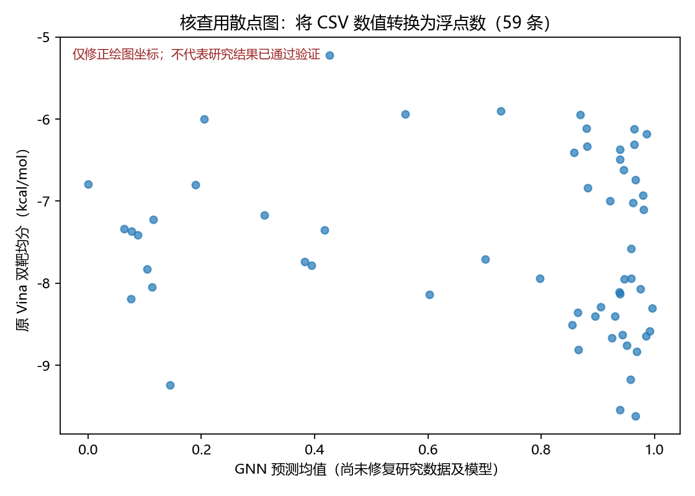

> 历史审计：以下结论针对 2026-09-04 快照。当前修正状态见 [项目状态](../../PROJECT_STATUS.md)；原诊断数值不作为修订版性能。

# 最终研究包验证与问题检查报告

核查日期：2026-09-05。对象：保肝中药成分虚拟筛选，`D:/zcode-workspace/final-aidd-screening`。

**结论：当前版本未通过研究有效性验证。计算结果能够在本机稳定复现，但分子身份、标签、骨架划分、描述符和模型实现存在实质问题，现有 AUC、候选排名与 Top-10 不能直接用作已验证的研究结论。**

本次保留原研究文件，所有核查、复跑和诊断性修正均存放在本报告所在目录。诊断性修正没有合并回研究，也没有生成替代的正式候选名单。

## 1. 范围与实际完成的检查

根据根目录 README 的“最终研究”指定，以最终包为主；交叉检查工作库 `hepato-gnn-screening` 的原始数据、数据字典、清洗实现、文献依据和旧验证程序，并比对两个库内的最终包副本。历史 MASH v1/v2、课程探索、旧论文等不同课题未逐项重新审计，不能据本报告宣称整个历史归档都已验证。

| 检查 | 实际结果 | 证据文件 |
|---|---|---|
| 最终包文件快照 | 226 个非 Python 缓存文件建立 SHA-256 清单 | `original_manifest.csv` |
| 两个最终包副本 | 工作库与归档库中，对主包清单内文件均未发现缺失或内容差异 | `local_findings.json` |
| 数据有效性、去重 | 100 条实际使用结构均可解析；忽略立体化学后未发现重复结构 | `structure_inventory.csv` |
| PubChem 身份核对 | 全部 100 条取得对应记录；52 条连接结构不一致，含 43 条分子式不一致 | `pubchem_identity_check.csv` |
| 描述符 | 100/100 条至少一个存储描述符与 RDKit 复算相差超过 0.05 | `descriptor_differences.csv` |
| 数据划分 | 58/13/17 行数正确；真实骨架存在跨集 | `cross_split_scaffolds.csv` |
| GNN 数值梯度 | W2 梯度错误；其余 5 组参数的抽检坐标通过 | `gradient_check.csv` |
| 测试指标独立复算 | AUC 0.950、BACC 0.833、F1 0.800、ECE 0.247 与表格一致 | `local_findings.json` |
| 原入口复跑 | 副本执行 `python run_all.py --model`，退出码 0，约 145 秒；所有 results 文件逐字节一致 | `reproduction.log`、`reproduction_status.json` |
| 原 redock 重跑 | 两个配体实际重新对接；原 RMSD/分数复现 | `reproduction.log` |
| 受体制备 | 2/2 从现有 clean PDB 重新制备，与原 PDBQT 逐字节相同 | `receptor_rechecks/` |
| 配体制备 | 60 条全部重新尝试；59 成功且逐字节一致，小檗碱原结构失败 | `ligand_preparation_check.csv` |
| 对接结果全量对账 | 118/118 成功分数与对应姿态内 Vina 记录一致；另 2 条是同一小檗碱的制备失败 | `docking_score_check.csv` |
| 对接独立抽样重跑 | HP-007、HP-005、HP-032、NV-008、NV-011 各双靶，共 10/10 分数精确复现 | `docking_rerun_comparison.csv` |
| 姿态自动几何检查 | 118 条中均无重原子间距 <1.5 Å 的严重近接；14 条有 1–2 个重原子越过盒边 | `pose_geometry_check.csv` |
| 共识评分 | 59 行按独立算式复算，无评分差异 | `supplement_findings.json` |
| 原“45 项”验证 | 程序确实输出 45 通过，但检查的是旧工作库结果 | `legacy_verify.log` |
| 化学修正的 redock 对照 | 两配体按 PDB CONECT + RCSB CCD 重新构建，在原受体/盒子下通过 2 Å | `corrected_redock_controls.json` |

**边界：**未将全部 118 次生产对接重新运行一遍；全量对账与 10 次重跑不能称为“118 次独立重跑”。没有完成跨机器/全新环境复现、全部 88 条标签的原始文献全文审核、实验验证或人工逐姿态药理审阅。坐标近接检查不能证明结合模式正确。报告的“完整”指当前最终管线从输入到结论均有核查覆盖，不表示所有研究主张均已通过。

## 2. 必须先修复的研究问题

### F01：分子名称与实际计算结构大面积不一致〔阻断〕

比较的是应用 `smiles_fix.json` 后的实际结构，而非只检查修订前 CSV。100 条结构中：

- 43 条分子式与对应 PubChem 记录不同；
- 另 9 条分子式相同，但忽略立体化学后的连接结构不同；
- 4 条连接结构相同，但立体化学表示不一致；
- 44 条在本次规范化比较中完全一致。

连接结构不一致分布为 HP 32/48、DC 10/40、NV 10/12。名称查询返回的记录需再按预期盐型、异构体和实验试剂身份人工确认；不能把全部差异直接自动替换。上述计数是数据库身份核查结果，明确的 Top-10 问题如下。

| 名称 / ID | 实际输入分子式 | 对应 PubChem 分子式 | 发现 | 数据库记录 |
|---|---|---|---|---|
| 黄芩苷 HP-007 | C21H18O10 | C21H18O11 | 少一个氧，榜首不是对应的黄芩苷结构 | [CID 64982](https://pubchem.ncbi.nlm.nih.gov/compound/64982) |
| 木犀草素 HP-005 | C15H10O6 | C15H10O6 | 本次身份比较一致 | [CID 5280445](https://pubchem.ncbi.nlm.nih.gov/compound/5280445) |
| 大黄酸 HP-032 | C15H8O6 | C15H8O6 | 连接结构/取代位置不一致 | [CID 10168](https://pubchem.ncbi.nlm.nih.gov/compound/10168) |
| 大黄素 HP-031 | C16H12O4 | C15H10O5 | 分子式与连接结构均不一致 | [CID 3220](https://pubchem.ncbi.nlm.nih.gov/compound/3220) |
| 牛蒡苷 HP-029 | C24H28O11 | C27H34O11 | 碳氢组成及连接结构不一致 | [CID 100528](https://pubchem.ncbi.nlm.nih.gov/compound/100528) |
| 葛根素 HP-013 | C21H20O9 | C21H20O9 | 连接结构/取代位置不一致 | [CID 5281807](https://pubchem.ncbi.nlm.nih.gov/compound/5281807) |
| 二氢杨梅素 HP-014 | C15H12O8 | C15H12O8 | 修订后本次比较一致 | [CID 161557](https://pubchem.ncbi.nlm.nih.gov/compound/161557) |
| 丹参酮IIA HP-048 | C14H10O3 | C19H18O3 | 分子式及骨架严重不符 | [CID 164676](https://pubchem.ncbi.nlm.nih.gov/compound/164676) |
| 姜黄素 HP-016 | C21H20O6 | C21H20O6 | 修订后本次比较一致 | [CID 969516](https://pubchem.ncbi.nlm.nih.gov/compound/969516) |
| 汉黄芩素 HP-008 | C16H12O4 | C16H12O5 | 少一个氧 | [CID 5281703](https://pubchem.ncbi.nlm.nih.gov/compound/5281703) |

**影响：**Top-10 有 7 个连接结构不一致；Vina 打分、GNN 图特征、Lipinski、PAINS 和分簇都作用在输入结构上，不能将这些结果归给表中的真实化合物。SMILES“能解析”只能证明语法/价态可接受，不等于身份正确。

修复须先建立名称—CID—InChIKey—立体结构—试剂身份的主表，重新生成所有派生文件并使旧缓存失效。本次完整比对及请求摘要保存在 `pubchem_identity_check.csv` 与 `external_checks/`。虎杖苷名称接口连续返回 404，改用 PubChem 页面已核实的 [CID 5281718](https://pubchem.ncbi.nlm.nih.gov/compound/Piceid) 完成核查，失败记录亦保留。

### F02：redock 共晶配体的键级和部分连接错误〔阻断〕

定位：[s2_prep_redock.py:46](../../../final-aidd-screening/src/s2_prep_redock.py:46)。提取仅保留 HETATM，丢掉 CONECT，再按空间距离推断键；未从 CCD 模板恢复键级。

| 配体 | 原保存 SDF 分子式 | RCSB CCD 分子式 | 原 SDF 键型 | 诊断 |
|---|---|---|---|---|
| FEX | C32H58N2O3 | C32H38N2O3 | 41 个单键 | 芳香/双键丢失，且比修正后的 40 个重原子键多一个 |
| IQK | C24H48N2O6S2 | C24H22N2O6S2 | 37 个单键 | 芳香键与磺酰双键丢失 |

数据库依据：[RCSB FEX](https://www.rcsb.org/ligand/FEX)、[RCSB IQK](https://www2.rcsb.org/ligand/IQK)。错误改变原子类型、氢数、可旋转键和评分，原“共晶配体回对接成功”证据不成立。

本次在独立目录保留 PDB CONECT、用 CCD SMILES 分配键级，并检查重建结构与 CCD 一致后做诊断性重跑。固定受体、原盒子、exhaustiveness=16、seed=42，结果见 F07。它证明局部修复可行，不等于整条候选管线已修好。

### F03：所谓骨架隔离存在实际跨集〔阻断〕

定位：[s3_model.py:122](../../../final-aidd-screening/src/s3_model.py:122)。分组使用沿袭的 CSV `scaffold`，没有对实际 RDKit 分子重建规范骨架。旧字段源自自制、依赖原子顺序的近似序列化，见工作库 [smiles_graph.py:110](../../../src/chem/smiles_graph.py:110)。

RDKit Murcko 骨架得到 47 组而非旧字段的 53 组；4 组横跨不同集合：

| 同骨架成员 | 跨越集合 |
|---|---|
| HP-025、HP-026、HP-027、DC-014、DC-015 | train / val / test |
| HP-031、HP-032、HP-033、HP-034 | train / test |
| DC-009、DC-010 | train / val |
| DC-018、DC-038 | train / val |

因此 58/13/17 的行数可以复现，但“无同骨架跨集”不成立。现有 AUC 不能作为严格新骨架泛化性能。结构身份修订完成后，须重建规范骨架、重新划分，并对所有集合两两求交断言。方法依据：[RDKit MurckoScaffold](https://rdkit.org/docs/source/rdkit.Chem.Scaffolds.MurckoScaffold.html)。

### F04：GNN 手写反向传播重复施加 Dropout〔阻断〕

定位：[s3_model.py:75](../../../final-aidd-screening/src/s3_model.py:75)。前向缓存 H1 已经乘过缩放后的掩码，计算 W2 梯度时又乘一次 m1。

在固定同一 Dropout 掩码、中心差分步长 1e-6 下，W2 抽检坐标：数值导数 −0.7118424171，程序导数 −1.0169177388，比例 **1.4285714287 = 1/(1−0.3)**。其他 5 组参数的最大梯度坐标误差均约 1e-11。

这确认了实现错误，但不能仅凭比例推算修正后的 AUC，也不能忽略 Adam 对常数梯度缩放的适应性。应删除重复掩码，扩展梯度校验，重新训练和评估。当前高 AUC 不能替代梯度正确性证据。

### F05：标签依据不足，且已有明确反例〔阻断〕

[数据字典](../../../docs/01_data_dictionary.md) 将 0 定义为“无保肝活性证据”，并混合惰性小分子、普通西药和肝毒性药物。这些并非统一实验条件下测定的阴性；剂量依赖的毒性也不能自动推出不存在其他条件下的保护作用。

[种子文献依据](../../../literature/01_classic_evidence.md) 明确称作者/期刊/年份为记忆归纳、正式引用前需核对，缺少逐分子 PMID/DOI、实验条件和结局的可追溯证据表。

具体反例：DC-030 麝香草酚的标签说明是“无保肝活性证据”，而已有小鼠四氯化碳肝损伤原始研究报告保护效应，PMID 10433875；另有大鼠吲哚美辛损伤研究 PMID 30600301。[原始研究 1](https://pubmed.ncbi.nlm.nih.gov/10433875/)、[原始研究 2](https://pubmed.ncbi.nlm.nih.gov/30600301/)。该反例与项目自己的“公开证据存在性”标签定义冲突；同时 DC-030 的输入结构身份本身也不匹配，需分开修正两个问题。

修复应先明确研究终点：证据存在性、某一种肝损伤模型保护效应，还是 FXR/KEAP1 特异活性。未知条目不应直接当作测定阴性。需要逐条证据表，并将未知样本单列；不能据上述反例直接自动重标全部负样本。

### F06：建模和适用域仍使用演示描述符〔阻断〕

定位：[s3_model.py:145](../../../final-aidd-screening/src/s3_model.py:145) 和 [common.py:35](../../../final-aidd-screening/src/common.py:35)。SMILES 修订只改结构字段；描述符矩阵直接读取 CSV 的旧估算值。工作库数据字典已注明 logP/TPSA 为演示级近似，最终报告却未充分保留这一限制。

差值阈值 0.05 下，100 条均至少一项不一致：MW 94、logP 98、TPSA 99、HBA 46、HBD 3、可旋转键 48、芳香体系列 29。后者有定义差别，不能把每个差值都解释成数值算法错误；但它们不能混称同一 RDKit 描述符口径。

保持现有结构和原划分，仅改用七维 RDKit 描述符的受控复算：

| 指标 | 原结果 | 仅改描述符 |
|---|---|---|
| 描述符 + LR 测试 AUC | 0.983 | **0.7833** |
| NV 域外数 | 7/12 | **9/12** |
| 域外状态变化 | — | NV-006、NV-008 |

此对照尚包含原结构/标签/划分缺陷，仅用于证明描述符问题会实质影响指标与降权。不能把 0.7833 当作修正后正式性能。见 `supplement_findings.json`。

## 3. 对接、图表及结论解释问题

### F07：RMSD 使用了重新叠合配体的口径〔重要〕

定位：[s2_prep_redock.py:100](../../../final-aidd-screening/src/s2_prep_redock.py:100)。`GetBestRMS` 会旋转/平移叠合配体，适于构象相似性，不能代替固定受体坐标系的对接位置误差。`CalcRMS` 可在不叠合的情况下处理原子对称匹配。[RDKit 官方说明](https://www.rdkit.org/docs/source/rdkit.Chem.rdMolAlign.html)。

| 情形 | FXR / FEX | KEAP1 / IQK |
|---|---:|---:|
| 原保存姿态，GetBestRMS | 0.7354 Å | 1.0950 Å |
| 同一原姿态，改用不叠合 CalcRMS | 0.7689 Å | 1.8519 Å |
| 配体化学修正后诊断重跑，不叠合 | 0.8016 Å | 1.8368 Å |
| 修正配体后的 Vina 分数 | −11.080 | −10.661 |

这次正确 RMSD 下仍小于 2 Å，**不能写成“双靶门控失败”**。需要修正的是原方法和原证据链。诊断仍采用共晶起始坐标、固定种子和已有受体；独立生成构象、多种子以及姿态人工检查尚未完成。

### F08：模型—对接散点图把数字画成了类别〔重要〕

定位：[s6_report.py:24](../../../final-aidd-screening/src/s6_report.py:24)。CSV 数值字符串直接传给 Matplotlib，两个轴按类别首次出现的次序编码，形成近对角线和密集标签。这不是实际数值相关性。[Matplotlib 类别轴文档](https://matplotlib.org/stable/gallery/lines_bars_and_markers/categorical_variables.html)。

本次查看了原图并仅修正数值转换，核查图如下。它使用原始未修正的研究结果，不是有效性背书。原图标题还写 60 候选，实际画的是 59 条排名。

### F09：缓存缺少输入及参数依赖校验〔重要〕

定位：[s4_dock.py:120](../../../final-aidd-screening/src/s4_dock.py:120)、[s2_prep_redock.py:123](../../../final-aidd-screening/src/s2_prep_redock.py:123)。配体/受体只按文件存在与否复用；分数只按 compound_id、target 复用。改变 SMILES、受体、盒子、软件或参数后，仍可能静默使用旧缓存。空分数也进入 done，后续可被当作 cached 而不重试。

当前快照的 118 条制备结构与输入一致，本次没有发现已发生的缓存混用；这是代码中确认存在、会阻碍后续正确修复的缺陷。应以结构哈希、受体哈希、盒子/参数/软件版本组成缓存键，失败条目单列并可重试。

### F10：小檗碱失败被错误归因于 Meeko 不支持阳离子〔重要〕

原 HP-043 实际式 C21H22NO4+，在 ETKDG 的两次尝试均返回 −1，尚未进入 Meeko。按 [PubChem CID 2353](https://pubchem.ncbi.nlm.nih.gov/compound/2353) 的 C20H18NO4+ 重试，保持 +1 形式电荷，构象生成及 Meeko PDBQT 写出均成功。详见 `berberine_preparation_check.json`。

因此应记录“原输入结构的构象生成失败”，并修订对应结构；不能保留“季铵盐不被 Meeko 支持”的结论。应记录失败阶段及原始异常，避免统一吞掉报错后猜原因。

### F11：45/45 通过检查的是旧版本〔重要〕

[verify.py:9](../../../reports/pdf_build/verify.py:9) 的 ROOT 指向旧工作库。它断言旧 GNN AUC=0.967，并读取旧 `results/docking/docking_scores.csv`、旧基线和旧排名；最终包是 AUC=0.950 与 `docking_real_scores.csv`。

本次原程序确实 45/45，通过事实应保留，但不可将其计作最终包的验证覆盖。本报告另行建立了最终包检查。该脚本只打印失败汇总、缺少按失败数返回非零退出码的机制，也不宜直接当作自动验收门禁。

### F12：PAINS 预警类型与“全部误报”叙述错误〔重要〕

原报告称 13 条全为 catechol_A。实际为 **9 条 catechol_A(92) + 4 条 quinone_A(370)**，后者包括大黄酸、大黄素等。规则命中可作为实验干扰风险标记，但现有证据不能确认这些命中“全部是误报”。结构修订后须重算，实验阶段再验证聚集、反应性和读出干扰。

### F13：低秩相关被解释为证据独立与融合有效〔重要〕

ρ≈0.17 只说明这一候选集合上单调相关较弱，不能证明统计独立、互补效益或共识有效。自制 Spearman 对并列值未采用平均秩；标准 SciPy 复算为 **0.16903**。数值影响小，独立性推断问题更重要。

融合权重 0.45/0.35/0.20、方差转换为 confidence 的 0.25 尺度、域外×0.9 均缺少验证依据。两靶直接平均可能掩盖单靶弱项；单靶失败时当前代码仍可对剩余分数求均值。59 条当前评分公式本身复算正确，但分数不是经校准的活性概率。需明确筛选目标、对照和消融/敏感性分析，尤其不能由对接分推出激动/抑制功能或保肝疗效。

### F14：Top-10 混入训练已知阳性，不能当作独立新发现〔重要〕

10 条全来自原 HP 阳性集，其中 6 条是训练成员、3 条验证成员、1 条测试成员；没有 NV。训练成员是 HP-005、HP-032、HP-013、HP-014、HP-016、HP-008。

已知阳性参与候选优先级整理可以保留，但应标注身份并分榜展示。它们的高模型分不能验证未见分子的发现能力。NV-011 在旧字典规定为“不占候选名额”的阳性对照，最终榜中却以候选参与排名（第 55）；应统一对照角色。

### F15：不确定性、校准与显著性论断强于证据〔重要〕

测试集仅 17 条（12 正、5 负），AUC=0.95 来自 60 个正负配对。按类别分层有放回抽样 3000 次，固定预测下 AUC 的百分位 95% 区间约 **[0.80, 1.00]**；这未包含训练、划分或身份修订的不确定性。

方差与绝对误差 Spearman=0.67647 可复算，但未与简单预测熵/离 0.5 的距离、其他模型不确定性或外部数据比较，不能单凭这一相关宣称 GNN 的新增价值已经验证。报告已诚实披露 ECE 0.247→0.319 变差，应保留。另需统一验证集上的确定性 logits 校准与测试 MC 均值变换的预测口径。

## 4. 文档与可复现性问题

### F16：靶点安全性材料已经过时〔重要〕

[s1_target_profile.py:24](../../../final-aidd-screening/src/s1_target_profile.py:24) 将奥贝胆酸“已上市/FDA批准”作为当前安全/临床支持。美国 FDA 的批准已于 **2025-11-24 撤回**；通知说明验证试验未确认临床获益，并有早期疾病受试者肝移植及死亡增加的问题。[FDA 撤回通知（Federal Register）](https://www.govinfo.gov/content/pkg/FR-2025-11-24/pdf/2025-20767.pdf)。

应区分“历史上获得批准”与当前状态，更不能以此直接证明 FXR 作为一般保肝靶点的安全性。KEAP1 档案用其他机制的 Nrf2 激动剂上市作为直接 Kelch 界面干预安全支持，也需补充机制对应的证据与明确临床编号。

### F17：指纹簇不等同于不同 Murcko 骨架〔一般〕

Butina 使用全分子 ECFP 距离，代码确有 37 个指纹簇，所选 10 条属于 10 个不同指纹簇；但它们只有 **8 个不同的 RDKit Murcko 骨架**。木犀草素与汉黄芩素相同，大黄酸与大黄素相同。应改称“指纹相似性簇代表”，若任务要求骨架互异则另加唯一性约束。8 个化学类别的计数本次成立。

### F18：种子与快速模式说明不准确〔一般〕

最终 GNN 明确使用 [seed=7](../../../final-aidd-screening/src/s3_model.py:225)，而非全文宣称的全部 seed=42；调参、划分和对接的确使用 42。`--model` 仅令 `download_structures=False`，仍重做两次 redock 并调用批量对接函数；缺缓存时会执行生产对接。应列出各模块种子，并让快速模式的行为与说明一致。

### F19：缺少可移植环境和完整运行清单〔重要〕

本机依赖可用，但最终包没有固定版本的依赖锁定文件或容器配置。受体准备路径硬编码到 APPDATA/Python312，Vina 硬编码 `vina.exe`。因此本次本机成功不代表 Linux 服务器或干净 Python 环境可一键成功。还缺少模型权重、输入/输出依赖哈希、完整生产运行参数与失败阶段清单。

本次环境为 Python 3.12.0、NumPy 1.26.4、SciPy 1.16.3、scikit-learn 1.4.0、RDKit 2026.3.3、Meeko 0.7.1、Matplotlib 3.8.2，详细记录在 `local_findings.json`。

### F20：来源追踪及报告自动更新不完整〔重要〕

原 `smiles_fix.json` 的 5 条记录无 CID、查询时间、源 URL 或版本哈希；不能仅凭 `valid: true` 证明权威来源。课程标准的页码/讲义原文未随最终包提供，不能将课程口号本身当作方法学验证。

`s6_report.py` 更新图和 summary.json，却不生成 REPORT.md；重跑后可能出现新数据与旧人工报告混用。最终候选表应包含每条输入身份、数据版本、标签来源、训练参与状态、各靶分数、适用域和实验验证状态，并由同一份数据自动生成报告关键表。

## 5. 修复顺序与验收标准

| 顺序 | 修复工作 | 验收标准 |
|---|---|---|
| 1 | 冻结当前版本，并在展示材料标为“待修订的计算初筛” | 原报告、图、排名可追溯；不再将旧 AUC/Top-10 宣称为验证完成 |
| 2 | 全量校正 100 条分子身份，明确盐型/立体化学；核对标签 | 每条有 CID/InChIKey/来源，未知标签分离，已发现反例处理；有逐条原始研究证据及终点 |
| 3 | 从权威主表重建描述符、规范骨架和划分 | 描述符与结构一致；训练/验证/测试的规范骨架交集为空；划分与各类计数留档 |
| 4 | 修 GNN 梯度，重训基线和 GNN | 固定掩码的梯度检验通过；调参仅用训练/验证；多划分或适当交叉验证；报告区间及基线比较 |
| 5 | 修共晶化学、RMSD、缓存键与失败管理 | 共晶身份与 CCD 一致；固定受体坐标 RMSD；输入变更触发失效；失败可重试；独立构象及多种子核对 |
| 6 | 对修订后候选重新制备、对接与人工审阅 | 旧配体/分数不混入；正负对照、各靶结果、失败原因齐全；关键姿态和网格边界人工核对 |
| 7 | 重做融合、分榜、多样性及图文 | 已知阳性/未知/对照分明；融合效益有对照；数值坐标正确；报告由当前数据生成；来源和监管资料更新 |

**原工作可保留的部分：**目录结构、受体制备方案、Vina 调用框架、已有输入输出的复现记录，以及能正确从给定预测复算的指标/评分实现。**必须重新计算或重新解释的部分：**分子身份修正后的全部模型与对接派生结果、严格骨架泛化指标、候选名单、PAINS/类药标记、适用域及相关报告结论。

## 6. 本次交付

- [问题清单（含定位和验收条件）](问题清单.csv)
- [100 条分子身份核查](pubchem_identity_check.csv)
- [本地核查数值证据](local_findings.json)
- [描述符/制备/评分补充复算](supplement_findings.json)
- [10 次对接重跑对照](docking_rerun_comparison.csv)
- [化学修正的 redock 诊断](corrected_redock_controls.json)
- [复跑状态](reproduction_status.json)

本目录中的核查程序、请求摘要和运行日志用于复核上述发现；诊断程序会写入本目录，原研究主包内容保持不变。有关研究有效性的判定来自多层证据，不能用某一份“通过”日志替代。
